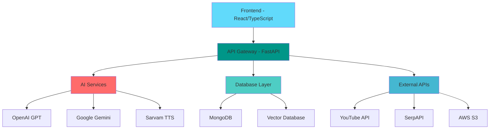

# 🚀 JumppGuru - AI-Powered Learning Platform

<div align="center">
  
  
  **Transform your learning experience with AI-driven personalized education**
  
  [](https://fastapi.tiangolo.com/)
  [](https://reactjs.org/)
  [](https://www.typescriptlang.org/)
  [](https://www.mongodb.com/)
  
  ### 🌐 [**Live Demo**](https://jump-front-three.vercel.app/) 🌐
</div>

---

## 🌟 Overview

JumppGuru is an innovative AI-powered learning platform that revolutionizes how users interact with educational content. Combining advanced natural language processing, multimedia generation, and personalized learning paths, it creates an immersive educational experience tailored to individual learning styles.

### 🎯 Key Highlights

- **🤖 AI-Powered Conversations**: Intelligent chat system with context-aware responses
- **🎵 Text-to-Speech Integration**: High-quality audio generation in multiple languages
- **📚 Smart Content Generation**: Automated lesson creation with visual aids
- **🎥 YouTube Integration**: Learn from video content with AI analysis
- **📝 Interactive Quizzes**: Auto-generated MCQs based on learning content
- **🔍 RAG-Enhanced Search**: Retrieval-Augmented Generation for accurate responses

---

## ✨ Core Features

### 🧠 Intelligent Learning Assistant
- **Multi-language Support**: Seamless communication in English and Hinglish
- **Context-Aware Responses**: Maintains conversation history for personalized interactions
- **Smart Query Processing**: Automatic routing between direct answers and research-based responses
- **Language Detection**: Automatically adapts to user's preferred language

### 🎨 Multimedia Content Generation
- **Visual Learning Materials**: AI-generated illustrations and diagrams
- **Interactive Tutorials**: Step-by-step guides with rich formatting
- **Audio Narration**: High-quality text-to-speech with natural voice synthesis
- **Markdown Rendering**: Beautiful formatting for educational content

### 📊 Personalized Learning Analytics
- **Learning Progress Tracking**: Monitor your educational journey
- **Chat History Management**: Organized conversation logs
- **Performance Insights**: Detailed analytics on learning patterns
- **Custom Learning Paths**: Tailored content based on user preferences

### 🎥 YouTube Learning Integration
- **Video Content Analysis**: Extract key learning points from YouTube videos
- **Recommended Videos**: Curated educational content suggestions
- **Interactive Playgrounds**: Hands-on learning environments
- **Video-Based Quizzes**: Generate assessments from video content

### 📝 Assessment & Evaluation
- **Auto-Generated MCQs**: Create quizzes from any learning material
- **Difficulty Customization**: Adjustable question complexity levels
- **Instant Feedback**: Real-time assessment results
- **Progress Tracking**: Monitor quiz performance over time

### 🔍 Advanced Search & Retrieval
- **Vector-Based Search**: Semantic understanding of queries
- **RAG Implementation**: Retrieval-Augmented Generation for accurate responses
- **Web Fallback**: Internet search integration for comprehensive answers
- **Knowledge Base**: Curated educational content repository

---

## 🏗️ Architecture



---

## 🚀 Getting Started

### Prerequisites

- **Node.js** (v18 or higher)
- **Python** (v3.8 or higher)
- **MongoDB** (v4.4 or higher)
- **Git**

### 📦 Installation

#### 1. Clone the Repository
```bash
git clone https://github.com/lokeshpanthangi/JumppGuru.git
cd JumppGuru
```

#### 2. Backend Setup
```bash
cd Backend
pip install -r requirements.txt
```

#### 3. Frontend Setup
```bash
cd Frontend
npm install
```

#### 4. Environment Configuration

Create `.env` files in both Backend and Frontend directories:

**Backend/.env**
```env
MONGO_URI=your_mongodb_connection_string
OPENAI_API_KEY=your_openai_api_key
GEMINI_API_KEY=your_gemini_api_key
SARVAM_API_KEY=your_sarvam_api_key
SERPER_API_KEY=your_serper_api_key
AWS_ACCESS_KEY_ID=your_aws_access_key
AWS_SECRET_ACCESS_KEY=your_aws_secret_key
AWS_REGION=your_aws_region
AWS_S3_BUCKET_NAME=your_s3_bucket
```

**Frontend/.env**
```env
VITE_BACKEND_URL=http://localhost:8000
```

### 🏃‍♂️ Running the Application

#### Start Backend Server
```bash
cd Backend
uvicorn app.main:app --reload --host 0.0.0.0 --port 8000
```

#### Start Frontend Development Server
```bash
cd Frontend
npm run dev
```

Access the application at `http://localhost:5173`

---

## 🛠️ Technology Stack

### Frontend
- **React 18** - Modern UI library with hooks
- **TypeScript** - Type-safe JavaScript development
- **Vite** - Fast build tool and development server
- **Tailwind CSS** - Utility-first CSS framework
- **Framer Motion** - Smooth animations and transitions
- **React Router** - Client-side routing
- **Tanstack Query** - Data fetching and caching

### Backend
- **FastAPI** - High-performance Python web framework
- **MongoDB** - NoSQL database for flexible data storage
- **OpenAI GPT** - Advanced language model integration
- **Google Gemini** - Multimodal AI capabilities
- **Sarvam AI** - Text-to-speech services
- **Vector Search** - Semantic search capabilities

### Infrastructure
- **AWS S3** - Cloud storage for media files
- **SerpAPI** - Web search integration
- **WebSocket** - Real-time communication
- **Docker** - Containerization support

---

## 📱 User Interface

### 🎨 Design Philosophy
- **Clean & Intuitive**: Minimalist design focused on learning
- **Responsive**: Seamless experience across all devices
- **Accessible**: WCAG compliant for inclusive learning
- **Dark/Light Mode**: Comfortable viewing in any environment

### 🧩 Key Components
- **Interactive Chat Interface**: Real-time AI conversations
- **Dynamic Dashboard**: Learning analytics and progress tracking
- **Multimedia Viewer**: Rich content display with audio/visual elements
- **Quiz Interface**: Engaging assessment tools
- **Notebook System**: Organized learning materials

---

## 🔧 API Endpoints

### Core Learning APIs
- `POST /query` - Process user queries with AI
- `POST /generate_mcqs` - Create personalized quizzes
- `GET /deep_learning/init` - Initialize learning modules
- `POST /deep_learning/generate` - Generate structured lessons

### Multimedia APIs
- `POST /genai/chat` - Multimodal AI conversations
- `POST /tts/stream` - Text-to-speech conversion
- `GET /tts/file/{filename}` - Audio file retrieval

### YouTube Integration
- `GET /youtube/recommend` - Video recommendations
- `POST /youtube/update_youtube_links` - Manage video content

---

## 🤝 Contributing

We welcome contributions from the community! Please read our contributing guidelines and submit pull requests for any improvements.

### Development Workflow
1. Fork the repository
2. Create a feature branch
3. Make your changes
4. Add tests if applicable
5. Submit a pull request


## 🙏 Acknowledgments

- **OpenAI** for GPT integration
- **Google** for Gemini AI services
- **Sarvam AI** for text-to-speech capabilities
- **MongoDB** for database solutions
- **React Community** for excellent frontend tools

---

<div align="center">
  <p><strong>Built with ❤️ for learners worldwide</strong></p>
  <p>© 2024 JumppGuru. All rights reserved.</p>
</div>
